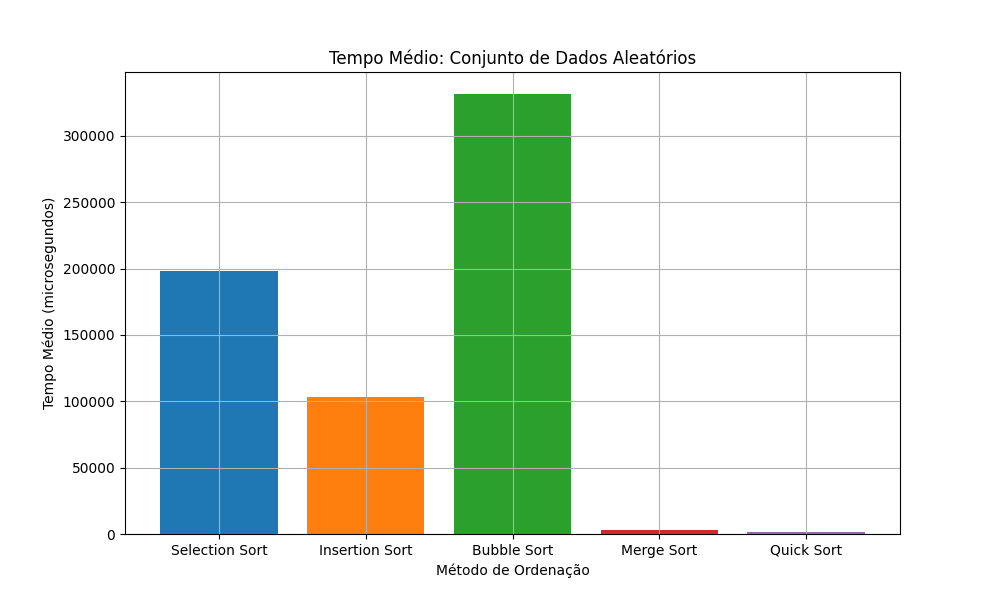
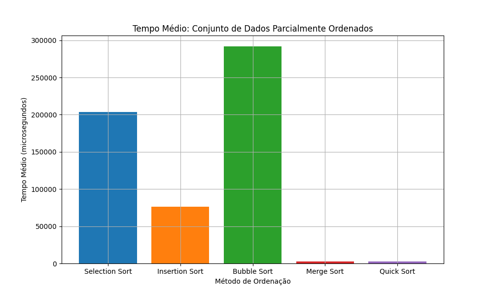
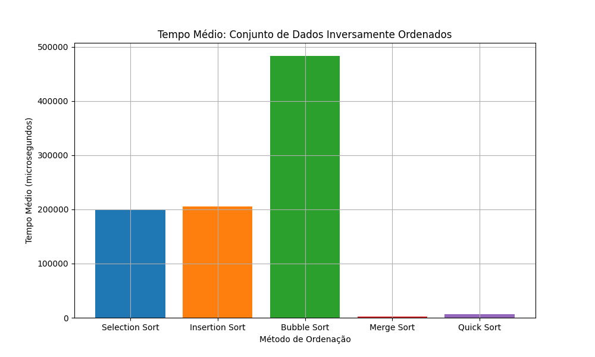

# Análise Comparativa de Algoritmos de Ordenação

<h2>Introdução</h2>

Este trabalho tem como objetivo aplicar e comparar os principais algoritmos de ordenação, analisando seu funcionamento, desempenho e aplicabilidade.
Os algoritmos de ordenação exercem um papel fundamental na ciência da computação, sendo amplamente utilizados em diversas áreas do conhecimento e aplicações práticas. Sua principal função consiste em organizar conjuntos de dados em uma ordem específica — geralmente crescente ou decrescente — de modo a facilitar operações subsequentes, como busca, análise e visualização de informações.
A eficiência na ordenação de dados impacta diretamente o desempenho de outros algoritmos e sistemas, como os de busca, estruturação de dados e gerenciamento de memória. 

## Fundamentação Teórica

### Selection Sort

Consiste em um algoritmo de classificação baseado em comparação. Ele classifica uma matriz por meio da repetida troca de posição do menor elemento não classificado pela menor posição disponível.

```bash
[7, 5,'1', 8, 3] // Menor elemento
['1', 5, 7, 8, 3] // Menor elemento -> índice 0
[1,'3', 7, 8, 5] // Segundo menor -> índice 1
[1, 3, '5', 8, 7] // ...
[1, 3, 5, '7', 8] // ...
```

### Implementação do Selection Sort

* Percorra toda a lista e descubra o **`menor elemento`**
* Troque de posição o **`menor elemento`** com o **`primeiro elemento`**
* Encontre o **`menor elemento (segundo menor)`** entre os elementos restantes e trocamos com o **`segundo elemento`** do vetor
* Continue o processo até que todo os elementos estejam classificados corretamente

### Complexidade Temporal 

**`Complexidade de tempo: O(n²)`** 
* **Melhor Caso: O(n²)**
* **Caso Intermediário: O(n²)**
* **Pior Caso: O(n²)**

### Complexidade Espacial

**`Complexidade Espacial: O(1)`** é a **única memoria extra utilizada** para variáveis temporárias

### Isertion Sort
<hr>

Consiste na classificação por meio da inserção de forma interativa de cada elemento de uma lista não classificada em sua posição correte em uma paerte classificadas da lista


### Implementação

* Começa com o segundo elemento da matriz, considerando o primeiro elemento como classificado
* Compara o segundo elemento com o primeiro, se o segundo for menor, troque-os de posição
* Compare o terceiro elemento com os anteriores e coloque-o na posição correta
* Repita até que toda a amtriz esteja classifcada

```bash
[23, 1, 10, 5, 2]
[23, '1', 10, 5, 2] // Elemento inicial
[23, '1', 10, 5, 2] // Parte classificada
[*23*, '1', 10, 5, 2] // Compara 1 com 23
[*1, 23*, 10, 5, 2] // Parte classificada 
[*1, 23*, '10', 5, 2] // Compara 10 com 1 e 23. Insere 10 entre 1 e 23
[*1, 10, 23*, 5, 2] // Parte classificada
[*1, 10, 23*, '5', 2] // Compara 5 com a parte classificada e insere entre 1 e 5
[*1, 5, 10, 23*, 2] // Parte classificada
[*1, 5, 10, 23*, '2'] // Compara 2 com a parte classificada e insere entre 1 e 5
[*1, 2, 5, 10, 23*] // Array classificado
```


### Complexidade Temporal do Insertion Sort

* **`Melhor caso: O(n)`**, **Conjunto de dados ordenados**
* **`Caso médio: O(n²)`**, **Conjunto de dados ordenados aleatoriamente**
* **`Pior caso: O(n²)`**, **Conjunto de dados ordenados inversamente**

### Complexidade Espacial

**`O(1)`**, o Insertion Sort requer apenas **O(1)** espaço adicional, semelhantemente ao **`Selection Sort`**


### Bubble Sort
<hr>

Consiste na troca repetidamente dos elementos adjacentes se eles estiverem na ordem errada. Esse algoritmo não é recomendado para grandes volumes de dados, pois a compelxidade de tempo média e para o pior caso é alta

## Implementação

* Ordenamos o array usando múltiplas passagens. Após a primeira passagem, o elemento máximo vai para o final (sua posição correta). Da mesma forma, após a segunda passagem, o segundo maior elemento vai para a penúltima posição e assim por diante.
* Em cada passagem, processamos apenas os elementos que ainda não foram movidos para a posição correta. Após k passagens, os maiores k elementos devem ter sido movidos para as últimas k posições.
* Em uma passagem, consideramos os elementos restantes, comparamos todos os adjacentes e trocamos de lugar se o elemento maior estiver antes do menor. Se continuarmos fazendo isso, obtemos o maior (dentre os elementos restantes) em sua posição correta.

### Complexidade Temporal

* **`Melhor caso: O(n)`**, **Conjunto de dados ordenados**
* **`Caso médio: O(n²)`**, **Conjunto de dados ordenados aleatoriamente**
* **`Pior caso: O(n²)`**, **Conjunto de dados ordenados inversamente**

### Complexidade Espacial

**`O(1)`**, o Bubble Sort requer apenas **O(1)** espaço adicional, semelhantemente ao **`Selection Sort`** e ao **`Insertion Sort`**. Porém o **`Bubble Sort`** precisa de **quantidade constante de espaço adicional**


### Quick Sort
<hr>

Consiste em um algoritmo de classificação baseada no **Dividir para conquistar** que escolhe um elemento como um pivô e particioa a matriz fornecida em torno do pivô escolhido, colocando o pivô em sua posição correta na matriz classificada

### Implementação

* Escolha um pivô
* Partição da matriz: Reorganiza a matriz ao redor do **`pivô`**. Após o particionamento, todos os elementos **`menores`** que o **`pivô`** estarão à sua **`esquerda`** e os **`maiores`** à sua **`direita`**. O pivô fica na posição correta e obtemos o índice do pivô
* **`Chame recurssivamete`**: Aplique recurssivamente o mesmo processo aos conjunto de dados **`particionadas`**
* **`Caso base`**: A recursão para quando resta apenas um elemento no subconjunto, pois um único elemento já está classificado


### Complexidade

* **`Melhor caso: O(log n)`**, **`Partições balanceadas`** - Cada partição com n/2 elementos
* **`Caso médio: O(n log n)`**, **O pivô divide a matriz em duas partes, mas não necessariamente iguais**
* **`Pior caso: O(n²)`**, Ocorre quando o **menor ou o maior elemento é sempre escolhido como pivô** (vetor classificado)

### Complexidade espacial

**`O(n)`**, devido a pilha de chamadas recursivas

## Metodologia

### Tipos de Dados
Foram utilizados nos testes conjuntos de dados com as seguites configuações:
* **`Ordenados Aleatoriamente`**

* **`Parcialmente Ordenados`**

* **`Inversamente Ordenados`**

### Tamanho dos Conjuntos de dados
Foram utilizados vetores de **`1000`** elementos, com valores entre **`1`** e **`100`**

### Métricas 

Coletou-se informações à respeito do tempo de execução de cada algoritmo de classificação para cada tipo de conjunto de dados (aleatorio, paricialmente ordenado e inversamente ordenado).

### Método de medição

Para a medição de tempo de execução, fora utilizado a função **`tempo_medio_exec`** no arquivo **`main.cpp`**. Essa função utiliza da biblioteca padrão do C++ **`<chrono>`** para a medição do tempo.A função recebe como parâmetro um dos algoritos de ordenação declarados no arquivo **`include/includes.hpp`** e o vetor que será ordenado. A função retorna o tempo médio de execução da implementação em 100 aplicações diferentes, utilizou-se dessa metodologia para aumentar a fidedignidade dos dados, já que apenas uma ou duas aplciações do mesmo algoritmo para o mesmo vetor não seria suficiente para levantar dados próximos da realidade de cada algoritmo, já que a apicação estaria sujeita a forte influencia de questões como hardware e memória cache disponível no momento.

```c++
#include <chrono>

template<typename Func>
long long tempo_medio_exec(const vector<int>& vetor, Func sort_func){
    long long duracao = 0;

    for (int i = 0; i < 100; i++) {
        // Garantia que o vetor que iremos ordenar não já foi ordenado em uma aplicação anterior do loop
        vector<int> copia_vetor = vetor;
        auto inicio = high_resolution_clock::now();
        // Algoritmo passado como parâmetro
        sort_func(copia_vetor);
        auto fim = high_resolution_clock::now();
        // Calculo do tempo de execução total
        duracao += duration_cast<microseconds>(fim - inicio).count();
    }
    // Tempo médio
    return duracao / 100;
}
```

## Resultados e Análises

### Tabelas 

<hr>

### **`Conjunto de Dados Ordenados Aleatoriamente`**

| Método de Ordenação | Tempo Médio (µs) |
|----------------------|------------------|
| Selection Sort       | 198.197          |
| Insertion Sort       | 103.603          |
| Bubble Sort          | 328.742          |
| Merge Sort           | 3.145            |
| Quick Sort           | 1.769            |

### **`Conjunto de Dados Parcialmente Ordenados`**

| Método de Ordenação | Tempo Médio (µs) |
|----------------------|------------------|
| Selection Sort       | 197.601           |
| Insertion Sort       | 77.875            |
| Bubble Sort          | 282.083           |
| Merge Sort           | 2.827             |
| Quick Sort           | 1.634             |

### **`Conjunto de Dados Inversamente Ordenados`**

| Método de Ordenação | Tempo Médio (µs) |
|----------------------|------------------|
| Selection Sort       | 200.280           |
| Insertion Sort       | 205.243           |
| Bubble Sort          | 483.131           |
| Merge Sort           | 2.590             |
| Quick Sort           | 6.089             |


### Graficos
<hr>

### **`Conjunto de Dados Ordenados Aleatoriamente`**


### **`Conjunto de Dados Parcialmene Ordenados`**


### **`Conjunto de Dados Inversamente Ordenados`**



